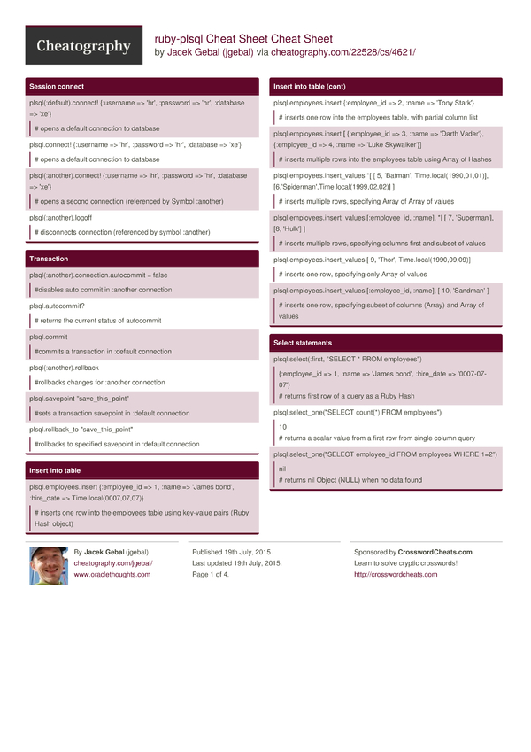

In my [previous posts](../posts/utplsql-vs-ruby-plsqlruby-plsql-spec-part-one.md) I did some writngs on [UTPLSQL](http://utplsql.sourceforge.net/) and [ruby-plsql](https://github.com/rsim/ruby-plsql).
For long time, while developing Oracle code I was using ruby-plsql to do test driven development for SQL and PL/SQL.
I used to frequently forget how to use some of the functionalities of ruby-plsql, specially after having a longer break and so each time I was referring the [Unit Tests supplied for the ruby-plsql library](https://github.com/rsim/ruby-plsql/tree/master/spec/plsql) as a reference. They are really nicely documenting how things work and how can they be used. It usually took me few minutes to find the thing I needed.

<!-- more -->
While I was actively using ruby-plsql for testing Oracle SQL and PLSQL code, it never occurred to me, that it would be nice to have some kind of cheat sheet, and so I wasted the valuable seconds and minutes to figure out how to do things I needed to do.
This week however, Turntablez posted a suggestion [on ruby-plsql-spec github project page](https://github.com/rsim/ruby-plsql-spec/issues/21) that a cheat sheet would be something of a use.
It was a really great idea, saves precious minutes when you need to use something you're not used to or just don't do every day.
So here it is, fully downloadable, editable and hopefully usable Cheat Sheet for ruby-plsql.
It's not a reference, it's not complete (or official), but hopefully it's a good overview and a fast help if you need to see how things work.
**Update**
If you prefer a more visual/printable form, you might want to check out the same Cheat Sheet on <http://www.cheatography.com/jgebal/cheat-sheets/ruby-plsql-cheat-sheet/>
Or just download the PDF version.

[ruby gutter="0" highlight="1,32,54,69,93,112,150"]
#Session / connection settings
plsql(:default).connect! {:username => 'hr', :password => 'hr', :database => 'xe'}
plsql.connect! {:username => 'hr', :password => 'hr', :database => 'xe'}
# opens a connection to database (referenced by Symbol :default, or no symbol at all)
plsql(:another).connect! {:username => 'hr', :password => 'hr', :database => 'xe'}
# opens a second connection (referenced by Symbol :another)
plsql.connection.prefetch\_rows = 100
# sets number of rows to be fetched at once from the database for default connection
plsql.connection.database\_version
# [11, 2, 0, 2]
# returns version of database as an array of elements: major, minor, update, patch
plsql.dbms\_output\_stream = STDOUT
# sets redirects dbms\_output to standard output (console)
# works even if exception on code occurs
plsql.dbms\_output\_buffer\_size = 100\_000
# sets dbms\_output buffer size to 100,000
plsql(:another).logoff
#disconnects connection (referenced by symbol :another) from the database
plsql.hr.class
# PLSQL::Schema
# You can reference objects in other schemas using schema name
#Transaction
plsql(:another).connection.autocommit = false
#disables auto commit in :another connection
plsql.autocommit?
# true
# returns the current status of autocommit for connection
plsql.commit
#commits a transaction in :default connection
plsql(:another).rollback
#rollbacks all uncommited changes in the current transaction for :another connection
plsql.savepoint "save\_this\_point"
#sets a transaction savepoint in :default connection
plsql.rollback\_to "save\_this\_point"
#performs a rollback of transaction to specified savepoint in :default connection
#Execute SQL statement or PLSQL block
plsql.execute "CREATE SYNONYM employees\_synonym FOR employees"
# executes any given string as a SQL or PLSQL statement
plsql.execute <<-SQL
CREATE TABLE test\_employees (
employee\_id NUMBER(15),
name VARCHAR2(50),
hire\_date DATE
)
SQL
#executes multi-line string statements too
#Insert into table
plsql.employees.insert {:employee\_id => 1, :name => 'James bond', :hire\_date => Time.local(0007,07,07)}
# inserts one row into the employees table using key-value pairs (Ruby Hash object)
plsql.employees.insert {:employee\_id => 2, :name => 'Tony Stark'}
# inserts one row into the employees table, with partial column list
plsql.employees.insert [ {:employee\_id => 3, :name => 'Darth Vader'}, {:employee\_id => 4, :name => 'Luke Skywalker'}]
# inserts multiple rows into the employees table using Array of Hashes
plsql.employees.insert\_values \*[ [ 5, 'Batman', Time.local(1990,01,01)], [6,'Spiderman',Time.local(1999,02,02)] ]
# inserts multiple rows, specifying Array of Array of values
plsql.employees.insert\_values [:employee\_id, :name], \*[ [ 7, 'Superman'], [8, 'Hulk'] ]
# inserts multiple rows, specifying columns first and subset of values
plsql.employees.insert\_values [ 9, 'Thor', Time.local(1990,09,09)]
# inserts one row, specifying only Array of values
plsql.employees.insert\_values [:employee\_id, :name], [ 10, 'Sandman' ]
# inserts one row, specifying subset of columns (Array) and Array of values
#Select statements
plsql.select(:first, "SELECT \* FROM employees")
# {:employee\_id => 1, :name => 'James bond', :hire\_date => '0007-07-07'}
# returns first row of a query as a Ruby Hash
plsql.select\_one("SELECT count(\*) FROM employees")
# 10
# returns a scalar value from a first row from single column query
plsql.select\_one("SELECT employee\_id FROM employees WHERE 1=2")
# nil
# returns nil Object (NULL) when no data found
plsql.select(:all, "SELECT \* FROM employees ORDER BY employee\_id")
# [ {:employee\_id => 1, :name => 'James bond', :hire\_date => '0007-07-07'}, {...}, ... ]
# returns all rows from a query as an Array of Hashes
#Select from a table/view
plsql.employees.select(:first, "ORDER BY employee\_id")
plsql.employees.first("ORDER BY employee\_id")
# {:employee\_id => 1, :name => 'James bond', :hire\_date => '0007-07-07'}
# returns first row from a table
plsql.employees.select(:first, "WHERE employee\_id = :a", 2)
plsql.employees.first("WHERE employee\_id = :a", 2)
plsql.employees.first(:employee\_id => 2)
# {:employee\_id => 2, :name => 'Tony Stark', :hire\_date => nil}
# returns first row from a table with WHERE condition
plsql.employees.select(:all, "ORDER BY employee\_id")
plsql.employees.all("ORDER BY employee\_id")
plsql.employees.all(:order\_by => :employee\_id)
# [ {:employee\_id => 1, :name => 'James bond', :hire\_date => '0007-07-07'}, {...}, ... ]
# returns all rows from a table sorted using ORDER BY
plsql.employees.all(:employee\_id => 2, :order\_by => :employee\_id)
# [ {:employee\_id => 2, :name => 'Tony Stark', :hire\_date => nil} ]
# returns all rows from a table with WHERE condition
plsql.employees.all "WHERE employee\_id = 2 AND hire\_date IS NULL"
plsql.employees.all( {:employee\_id => 2, :hire\_date => nil} )
# [ {:employee\_id => 2, :name => 'Tony Stark', :hire\_date => nil} ]
# returns all rows from a table with WHERE condition on NULL value
plsql.employees.all(:hire\_date => :is\_not\_null)
# [ {:employee\_id => 1, :name => 'James bond', :hire\_date => '0007-07-07'}, {...}, ... ]
# returns all rows from a table with WHERE condition on NOT NULL value
plsql.employees.select(:count)
plsql.employees.count
# 10
# returns count of rows in the table
#Update table/view
plsql.employees.update :name => 'Test'
# updates field name in all records
plsql.employees.update :name => 'Superman II', :where => {:employee\_id => 7}
plsql.employees.update :name => 'Superman II', :where => "employee\_id = 7"
# updates field in table with a where condition
plsql.employees.update :name => 'Superman II', :hire\_date => Time.local(2000,01,01), :where => "employee\_id = 7"
# updates two fields in table with a where condition
[/ruby]
[ruby gutter="0" highlight="1,8,39,53,67,94,107,119,131"]
#Delete from table/view
plsql.employees.delete :employee\_id => 10
plsql.employees.delete "employee\_id = 10"
#delete record in table with WHERE condition
#Table/View meta-data
plsql.execute "CREATE OR REPLACE VIEW employees\_v AS SELECT \* FROM employees"
#creates a VIEW
plsql.employees\_v.class
# PLSQL::View
# The employees\_v Object is of PLSQL::View class
plsql.employees.class
# PLSQL::Table
# The employees Object is of PLSQL::Table class
plsql.employees\_synonym.class
# PLSQL::Table
# The emplyees\_synonym Object is also of PLSQL::Table class
plsql.employees.column\_names
plsql.employees\_v.column\_names
# [ employee\_id, name, hire\_date ]
# returns all column names in table
plsql.employees.columns
plsql.employees\_v.columns
# { :employee\_id => {
:position=>1, :data\_type=>"NUMBER", :data\_length=>22, :data\_precision=>15, :data\_scale=>0, :char\_used=>nil,
:type\_owner=>nil, :type\_name=>nil, :sql\_type\_name=>nil, :nullable => false, :data\_default => nil}
, ...}
# returns column meta-data
#Sequence
plsql.execute "CREATE SEQUENCE employees\_seq"
#executes a statement to create a sequence
plsql.employees\_seq.nextval
# 1
# returns NEXTVAL for sequence
plsql.employees\_seq.currval
# 1
# returns CURRVAL for sequence
#Package
plsql.test\_package.class
# PLSQL::Package
# A plsql package is Object of PLSQL::Package class
plsql.test\_package.test\_variable = 1
# Assigns a value to package public variable
plsql.test\_package.test\_variable
# 1
# Reads a value to package public variable
#Procedure / Function
# given a FUNCTION uppercase( p\_string VARCHAR2 ) RETURN VARCHAR2
plsql.uppercase( 'xxx' )
plsql.uppercase( :p\_string => 'xxx' )
# 'XXX'
# executes the function binding parameters by position or name and returns scalar Object as a value
# given a FUNCTION copy\_function( p\_from VARCHAR2, p\_to OUT VARCHAR2, p\_to\_double OUT VARCHAR2 ) RETURN NUMBER
plsql.copy\_function( 'abc', nil, nil)
plsql.copy\_function( :p\_from => 'abc', :p\_to => nil, :p\_to\_double => nil)
plsql.copy\_function( 'abc' )
# [ 3, { :p\_to => "abc", :p\_to\_double => "abcabc" } ]
# executes the function and returns 2 element Array
# with first element being function result and second element being a Hash of OUT parameters
#Given a PROCEDURE copy\_proc( p\_from VARCHAR2, p\_to OUT VARCHAR2, p\_to\_double OUT VARCHAR2 )
plsql.copy\_proc( 'abc', nil, nil)
plsql.copy\_proc( :p\_from => 'abc', :p\_to => nil, :p\_to\_double => nil)
plsql.copy\_proc( 'abc' )
# { :p\_to => 'abc', :p\_to\_double => 'abcabc' }
# executes the procedure and returns a Hash of OUT parameters as a :name => 'value' pairs
#Record types/Object Types
#Given a FUNCTION get\_full\_name( p\_employee employees%ROWTYPE ) RETURN VARCHAR2
plsql.get\_full\_name( {:p\_employee => {:employee\_id => 2, :first\_name => 'Tony', :last\_name => 'Stark', :hire\_date => nil} } )
plsql.get\_full\_name( {:employee\_id => 2, :first\_name => 'Tony', :last\_name => 'Stark', :hire\_date => nil} )
plsql.get\_full\_name( {'EMPLOYEE\_ID' => 2, 'first\_name' => 'Tony', 'last\_NaMe' => 'Stark', 'hire\_date' => nil} )
# 'Tony Stark'
# Accepts a record as a parameter (by name or by position) and executes the function returning String (VARCHAR2)
# Record fields can be defined as a Symbol (:employee\_id) or as a String ('employee\_id')
# Works the same way with package level record types and Oracle object types
#Varrays and Nested Tables
#Given a TYPE table\_of\_int IS TABLE OF INTEGER;
#Given FUNCTION sum\_items(p\_items TABLE\_OF\_INT) RETURN INTEGER
plsql.sum\_items( [1,2,3,4,5] )
plsql.sum\_items( :p\_items => [1,2,3,4,5] )
# 15
# Nested tables are passed in and returned as Ruby Array Object type
# Works the same way for VARRAYS
#Associative arrays (aka plsql tables, index-by tables)
#Given a package MY\_PACKAGE
# contains TYPE index\_table\_of\_int IS TABLE OF INTEGER INDEX BY BINARY\_INTEGER;
# contains FUNCTION sum\_items(p\_items INDEX\_TABLE\_OF\_INT) RETURN INTEGER;
plsql.my\_package.sum\_items( { -1 => 1, 5 => 2, 3 => 3, 4 => 4} )
# 10
# Associative arrays are passed in and returned as a Ruby Hash containing list of key value pairs
# Where key is the element position in Array and value is the value at the position
#Cursors
#Given a FUNCTION get\_empolyees RETURN SYS\_REFCURSOR
plsql.get\_employees do |result|
result.columns
end
# [ :employee\_id, :name, :hire\_date ]
# returns the list of columns of a cursor as an Array
plsql.get\_employees do |result|
result.fetch\_hash\_all
end
plsql.get\_employees{ |cursor| cursor.fetch\_hash\_all }
plsql.get\_employees{ |any\_name| any\_name.fetch\_hash\_all }
# [ {:employee\_id => 1, :name => 'James bond', :hire\_date => '0007-07-07'}, {...}, ... ]
# fetches all rows from a cursor and returns them as an Array of Hashes
# cursor needs to be accessed inside a block ( do .. end / { .. } )
# as cursors are automatically closed after the function call ends
plsql.get\_employees{ |result| result.fetch\_hash }
# {:employee\_id => 1, :name => 'James bond', :hire\_date => '0007-07-07'}
# fetches one row from a cursor and returns it as a Hash
plsql.get\_employees{ |result| result.fetch }
# [1, 'James bond', '0007-07-07']
# fetches one row from a cursor and returns it as a Array of values
plsql.get\_employees{ |result| result.fetch\_all }
# [[1, 'James bond', '0007-07-07'], [...], ... ]
# fetches all rows from a cursor and returns them as an Array of Arrays of values
[/ruby]
If you like it, share it, rate it, comment it.
