In my [previous posts](../posts/utplsql-vs-ruby-plsqlruby-plsql-spec-part-one.md) I have described some differences between utPLSQL and ruby-plsql. This time I want to focus on automating the test execution with each of those frameworks using [Jenkins Continuous Integration](https://jenkins-ci.org/).

<!-- more -->

# The reasons for continuous testing

Some of the problems that I often see in projects is that developers don't fully acknowledge the power of unit testing and the benefits for them coming out of having those in place.
If your code is ~100% tested, and by tested I mean automated tests (unit tests, integration tests, whatever the flavour) then you will no longer need to practice "techniques" like:

- Fear Driven Development - *"Don't touch it, you don't know what will break if you change it"* or *"I don't know what will happen if I change it, so I'd better copy the code into separate procedure and change the one line I need to be different"*
- Developer Centric Code - *"That's not my code, I will not touch it as I have no clue what it does"*

Instead you will start to practice the kind of development that will:

- Make you return home being proud of your achievements and being certain, that what you did was done right and that everything is still working.
- Allow you to know almost instantly how the change affected the entire system, as the tests will give you feedback, so you know that the system is still stable after your change.

You will also become confident enough to think, say and do things like:
*"Oh, now that I need to add new functionality to the existing code, I might actually restructure and refactor it to benefit from new features of Oracle 12 and all the new the things I've learned. Since I have all my tests in place to keep the change safe, I can do whatever changes needed, without being scared of the mess that the changes might bring."*
Of course, there is the fearless-developer kind. Those would do all the above with full confidence without having a single test in place. The problem is that this kind of fearlessness is of the ignorance kind. Those developers are either unaware of potential consequences or simply ignore them. One way or the other, this is not the kind of courage we want. I would not dare calling people with this kind of attitude professional developers.
But back to the subject.
**What is the point of having unit tests, if they are not executed?**
When you change a procedure/function you might think that it's good-enough to execute the tests related to the changed code. This will only be true, if there is no other code that is using the function/procedure. In most of the systems however, there are many dependencies between functions/procedures/tables/views. One reads/writes/calls another.
When a change is done to a piece of system, there is no better way to make sure that the whole system still works than to test entire system.
This leads to one sole conclusion. To make sure that everything is till working as expected and nothing is broken, it would be advisable to run all the tests there are for entire system each time you make a change to the system (add a column, change a view, modify procedure). And the sooner you execute the tests, the better, as you will get to know if your change does not break the system faster.
As the number of tests grow, the time needed for having them completed grows.
According to a talk I've heard on one of Warsaw Java conferences there is a high dependency between time taken for tests to execute and the frequency the developers execute those tests.

- If tests run in several seconds, developers will execute them as often as their code is compilable (really short cycles).
- **If tests run over 20 minutes, developers will not execute test more than once a day**. Developers actually do not know throughout the day how the change is affecting entire system

This leads to one conclusion. Tests, to be useful, must be really fast. As a developer, you should not only think of how to make your production code run fast, you should make sure that your tests are lightweight and extremely fast, while still being highly valuable.
That would be a perfect world and that is much easier to apply on non database related testing. With databases, we test operations done on data in database, that involves reading and writing database segments and there is almost no chance that having a large system with thousands of unit tests, you will be able to go down to seconds to execute them all.
What can be done however, is that you can execute all the tests that you know are related to the change being done.
Once you're done, and you commit your code to version control system (I believe you have one), a dedicated server can pick up the changes and run the entire set of tests for you. This is one of great things about CI servers. They just make your life easier by running the hard jobs on separate machine/process somewhere in background and keeping track of the overall health status of your system.
Let's proceed and see how utPLSQL and ruby-plsql can make our life easier with [Jenkins CI](https://jenkins-ci.org/)
I will not cover steps needed to download, install and configure Jenkins on your machine. I believe there are plenty of tutorials on the web that will help you with this. I will focus on configuring and running Oracle unit tests on that platform.

# ruby-plsql on Jenkins

I've already mentioned in my [previous post](../posts/utplsql-vs-ruby-plsqlruby-plsql-spec-part-three.md) that we can have JUnit reports generated from RSpec with two simple lines:
A onetime installation of the reported library (gem)

```
gem install rspec_junit_formatter
```

And test execution command that will cause test outputs to be formatted into JUnit XML format.

```
rspec -f RspecJunitFormatter -o rspec_test_results.xml
```

The machine that will be running Jenkins with ruby-plsql unit tests needs to have Ruby+Oracle client or Java+JRuby+JDBC driver installed and configured.
If you have already went through the installation of Ruby locally, that should not cause you trouble. I've described basic steps needed in [one of my previous posts](../posts/utplsql-vs-ruby-plsqlruby-plsql-spec-part-two.md)
Jenkins configuration steps:

- Install GIT plugin for Jenkins - to allow Jenkins pulling your tests from version control
[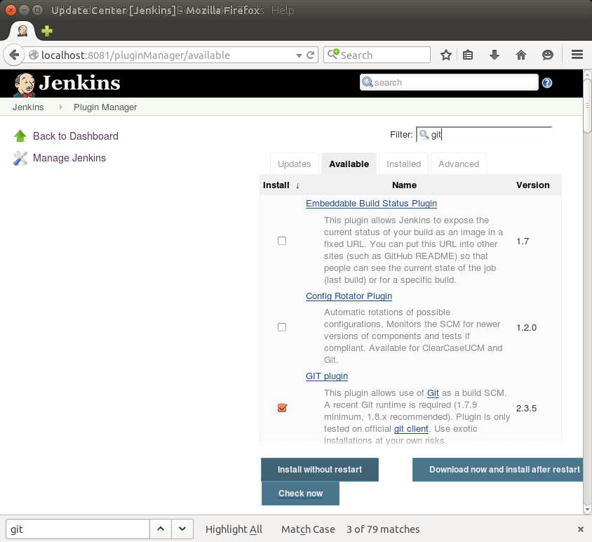](../../images/1.InstallJenkinsGITplugin.png)- Install HTML Publisher plugin for Jenkins - so that Jenkins is able to display HTML Code Coverage reportd from your tests
[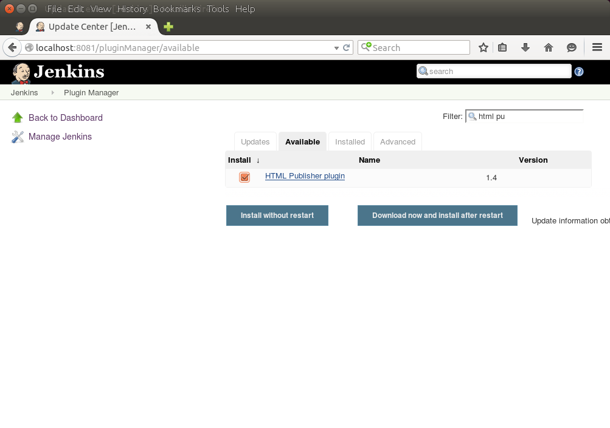](../../images/2.InstallJenkinsHTMLPublishPlugin.png)- Create a new job of type Freestyle and give it a meaningful name
[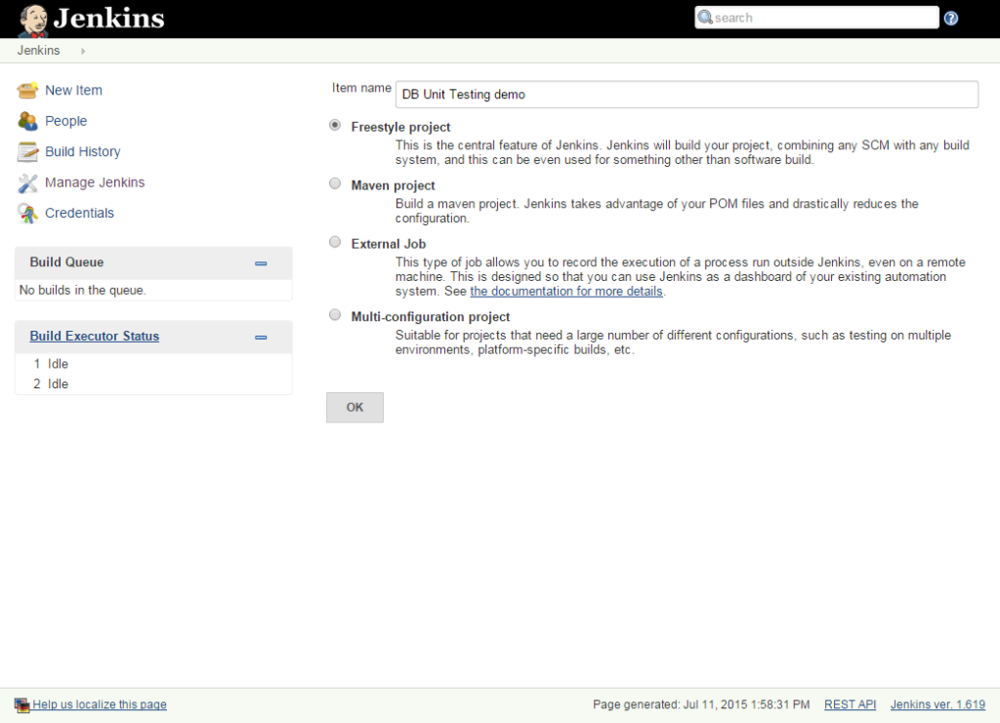](../../images/CreateFreestyleJenkinsJob.png)- Configure the job to do the following

- Check version control system every 15 minutes, if any changes were commited, run tests
- Once a day around 10 PM run tests regardless of changed in version control system
- Set up environment variables for unit testing before tests are executed - you may not need this, you you have system-wide config for Oracle
- Run all the unit tests found with code coverage, junit reporting and do not mark job as failed (red) when one of tests fail - this is to allow Jenkins jobs to become "yellow" when some tests are failing. Job will become red only when a job was unable to run the tests
- Publish unit test results
- Publish three sets of code coverage results if they were generated

[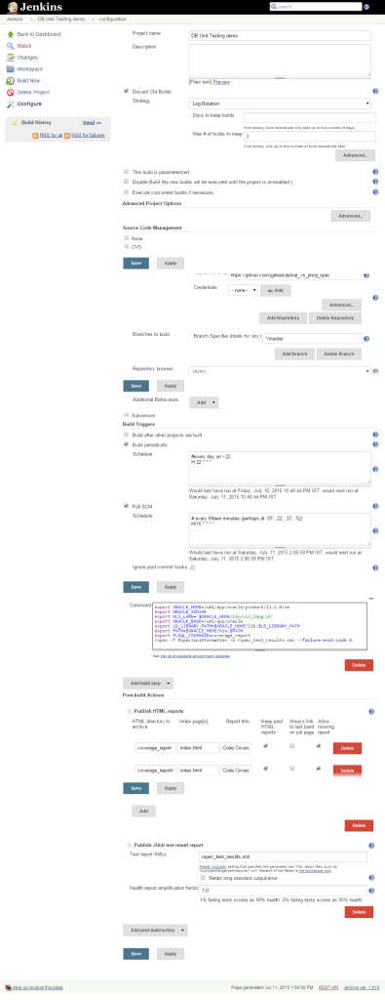](../../images/Jenkins-job-config.png)
Here is the config.xml file created for the demo job by Jenkins.
[xml collapse="1"]
<?xml version='1.0' encoding='UTF-8'?>
<project>
<actions/>
<description></description>
<logRotator class="hudson.tasks.LogRotator">
<daysToKeep>-1</daysToKeep>
<numToKeep>3</numToKeep>
<artifactDaysToKeep>-1</artifactDaysToKeep>
<artifactNumToKeep>-1</artifactNumToKeep>
</logRotator>
<keepDependencies>false</keepDependencies>
<properties/>
<scm class="hudson.plugins.git.GitSCM" plugin="git@2.3.5">
<configVersion>2</configVersion>
<userRemoteConfigs>
<hudson.plugins.git.UserRemoteConfig>
<url>https://github.com/jgebal/utplsql\_vs\_plsql\_spec</url>
</hudson.plugins.git.UserRemoteConfig>
</userRemoteConfigs>
<branches>
<hudson.plugins.git.BranchSpec>
<name>\*/master</name>
</hudson.plugins.git.BranchSpec>
</branches>
<doGenerateSubmoduleConfigurations>false</doGenerateSubmoduleConfigurations>
<submoduleCfg class="list"/>
<extensions/>
</scm>
<canRoam>true</canRoam>
<disabled>false</disabled>
<blockBuildWhenDownstreamBuilding>false</blockBuildWhenDownstreamBuilding>
<blockBuildWhenUpstreamBuilding>false</blockBuildWhenUpstreamBuilding>
<triggers>
<hudson.triggers.TimerTrigger>
<spec>#every day on ~22
H 22 \* \* \*</spec>
</hudson.triggers.TimerTrigger>
<hudson.triggers.SCMTrigger>
<spec># every fifteen minutes (perhaps at :07, :22, :37, :52)
H/15 \* \* \* \*</spec>
<ignorePostCommitHooks>false</ignorePostCommitHooks>
</hudson.triggers.SCMTrigger>
</triggers>
<concurrentBuild>false</concurrentBuild>
<builders>
<hudson.tasks.Shell>
<command>export ORACLE\_HOME=/u01/app/oracle/product/11.2.0/xe
export ORACLE\_SID=XE
export NLS\_LANG=`$ORACLE\_HOME/bin/nls\_lang.sh`
export ORACLE\_BASE=/u01/app/oracle
export LD\_LIBRARY\_PATH=$ORACLE\_HOME/lib:$LD\_LIBRARY\_PATH
export PATH=$ORACLE\_HOME/bin:$PATH
export PLSQL\_COVERAGE=coverage\_report
rspec -f RspecJunitFormatter -o rspec\_test\_results.xml --failure-exit-code 0
</command>
</hudson.tasks.Shell>
</builders>
<publishers>
<htmlpublisher.HtmlPublisher plugin="htmlpublisher@1.4">
<reportTargets>
<htmlpublisher.HtmlPublisherTarget>
<reportName>Code Coverage default session Report</reportName>
<reportDir>coverage\_report</reportDir>
<reportFiles>index.html</reportFiles>
<alwaysLinkToLastBuild>false</alwaysLinkToLastBuild>
<keepAll>true</keepAll>
<allowMissing>true</allowMissing>
<wrapperName>htmlpublisher-wrapper.html</wrapperName>
</htmlpublisher.HtmlPublisherTarget>
<htmlpublisher.HtmlPublisherTarget>
<reportName>Code Coverage secondary session Report</reportName>
<reportDir>coverage\_report/secondary</reportDir>
<reportFiles>index.html</reportFiles>
<alwaysLinkToLastBuild>false</alwaysLinkToLastBuild>
<keepAll>true</keepAll>
<allowMissing>true</allowMissing>
<wrapperName>htmlpublisher-wrapper.html</wrapperName>
</htmlpublisher.HtmlPublisherTarget>
<htmlpublisher.HtmlPublisherTarget>
<reportName>Code Coverage different user Report</reportName>
<reportDir>coverage\_report/different\_user</reportDir>
<reportFiles>index.html</reportFiles>
<alwaysLinkToLastBuild>false</alwaysLinkToLastBuild>
<keepAll>true</keepAll>
<allowMissing>true</allowMissing>
<wrapperName>htmlpublisher-wrapper.html</wrapperName>
</htmlpublisher.HtmlPublisherTarget>
</reportTargets>
</htmlpublisher.HtmlPublisher>
<hudson.tasks.junit.JUnitResultArchiver plugin="junit@1.2-beta-4">
<testResults>rspec\_test\_results.xml</testResults>
<keepLongStdio>false</keepLongStdio>
<testDataPublishers/>
<healthScaleFactor>1.0</healthScaleFactor>
</hudson.tasks.junit.JUnitResultArchiver>
</publishers>
<buildWrappers/>
</project>
[/xml]
Once the Jenkins setup is in place we can benefit from all the goodies we have in our configuration. Jenkins will publish for us.

- history of builds (job executions), test results trend graph
[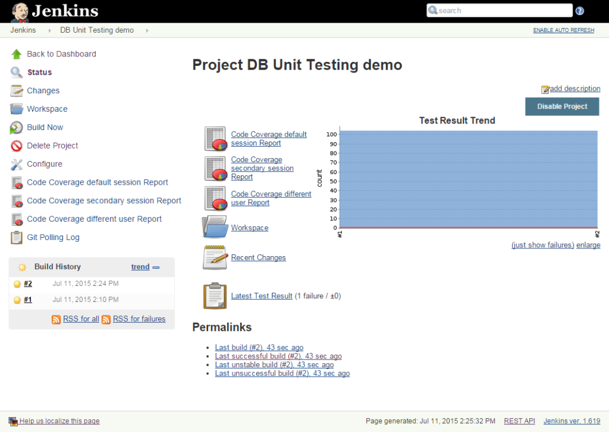](../../images/Jenkins-job-main-page.png)
- timeline of builds with job durations
[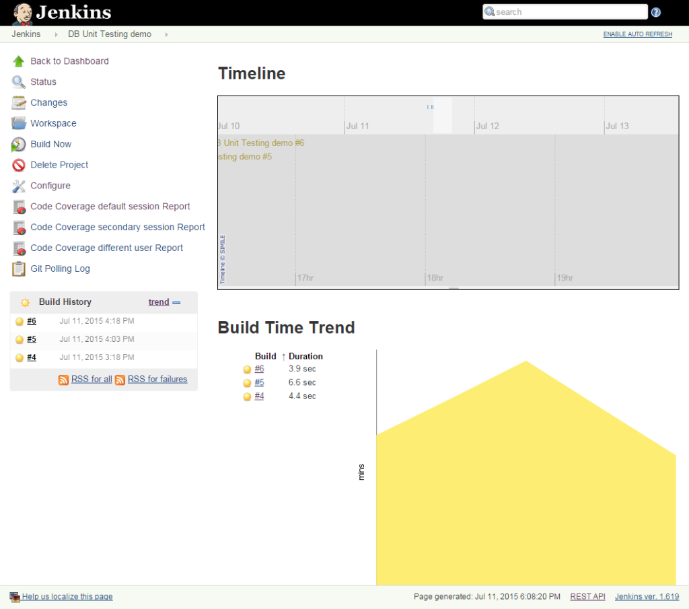](../../images/Jenkins-job-timeline.png)
- test results reports for every build
[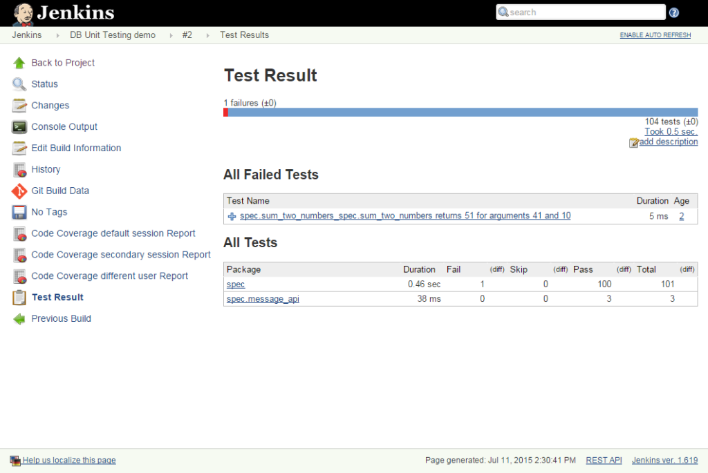](../../images/Jenkins-test-results.png)
- ability to navigate to detailed test results
[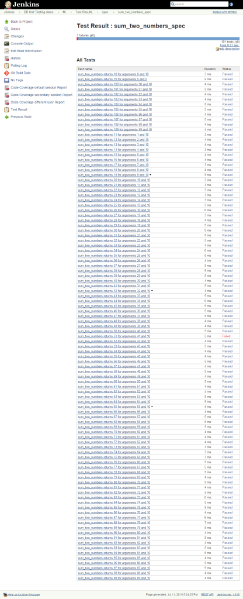](../../images/Jenkins-test-results-detailed.png)
- details of failed tests
[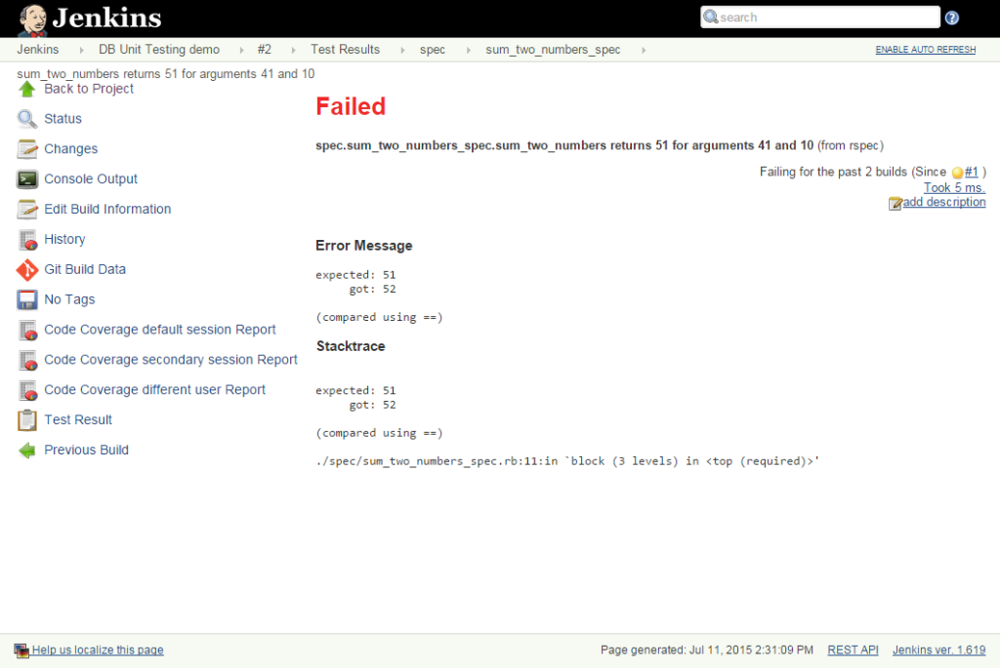](../../images/Jenkins-failed-tests.png)
- code coverage reports for every build
[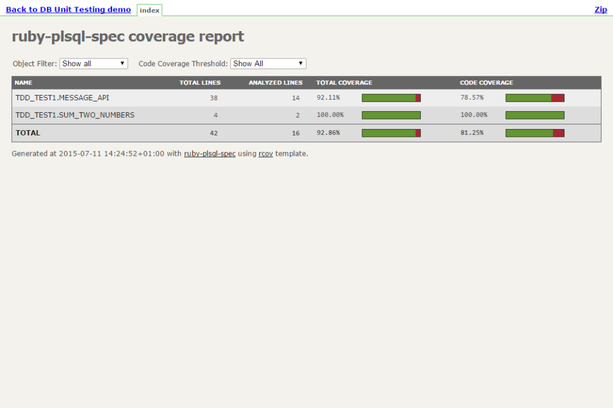](../../images/Jenkins-code-coverage.png)
[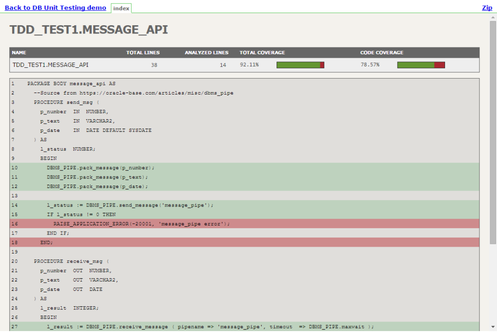](../../images/Jenkins-code-coverage-detail.png)

- and more

# utPLSQL v2 on Jenkins

I've found a blog [post by Kevin McCormack](http://www.theserverlabs.com/blog/2009/05/18/continuous-integration-with-oracle-plsql-utplsql-and-hudson/) describing a sample configuration of utPLSQL with Jenkins. In order to use utPLSQL utility with Jenkins, you need to get familiar with Maven build tool for Java and learn how to install and configure it. I'd rather have a Jenkins job that calls `sqlplus` and somehow parses utPLSQL results so they can be interpreted by Jenkins to provide all the information on tests execution that you can get.
Anyway I gave it a try, following instructions from the mentioned blog post and adjusting the configuration to fit into my project.
Here are the steps I have taken to have Jenkins integration for my utPLSQL tests.
Install the required tools for running the utPLSQL tests on Jenkins

- Maven tool
- The Maven utPLSQL plugin
- Oracle JDBC driver

Modify the pom.xml configuration file for Maven build job to:

- use jdbc driver for Oracle 11.2.0.2
- use correct database user/password
- execute only the tests and do not install any database changes

My pom.xml file after modifications

```xml
<?xml version="1.0" encoding="UTF-8"?>
<project xmlns="http://maven.apache.org/POM/4.0.0" xmlns:xsi="http://www.w3.org/2001/XMLSchema-instance" xsi:schemaLocation="http://maven.apache.org/POM/4.0.0 http://maven.apache.org/maven-v4_0_0.xsd">
  <modelVersion>4.0.0</modelVersion>
  <groupId>com.tsl.plsqltest</groupId>
  <artifactId>plsqltest</artifactId>
  <packaging>jar</packaging>
  <version>1.0-SNAPSHOT</version>
  <name>PL SQL test project</name>

  <dependencies>
    <dependency>
      <groupId>junit</groupId>
      <artifactId>junit</artifactId>
      <version>3.8.2</version>
      <scope>test</scope>
    </dependency>
  </dependencies>
  <build>
    <plugins>
      <plugin>
        <groupId>com.theserverlabs.maven.utplsql</groupId>
        <artifactId>maven-utplsql-plugin</artifactId>
        <version>1.0-SNAPSHOT</version>

        <dependencies>
          <dependency>
            <groupId>com.oracle</groupId>
            <artifactId>ojdbc6</artifactId>
            <version>11.0.2.0.0</version>
          </dependency>
        </dependencies>

        <configuration>
          <driver>oracle.jdbc.driver.OracleDriver</driver>
          <url>jdbc:oracle:thin:@localhost:1521:xe</url>
          <username>tdd_test1</username>
          <password>tdd_test1</password>
          <!--<packageName>betwnstr</packageName>-->
          <testSuiteName>ALL</testSuiteName>
        </configuration>
        <executions>
          <execution>
            <id>run-plsql-test-packages</id>
            <phase>process-test-resources</phase>
            <goals>
              <goal>execute</goal>
            </goals>
          </execution>
        </executions>
      </plugin>

    </plugins>

  </build>
</project>
```

Create and configure a new Jenkins job of type Maven, to do similar things as the job for ruby-plsql unit tests.

- Check version control system every 15 minutes, if any changes were commited, run tests
- Once a day around 10 PM run tests regardless of changed in version control system
- Set up environment variables for unit testing before tests are executed - you may not need this, you you have system-wide config for Oracle
- Run all the unit tests found with code coverage, junit reporting and do not mark job as failed (red) when one of tests fail - this is to allow Jenkins jobs to become "yellow" when some tests are failing. Job will become red only when a job was unable to run the tests
- Publish unit test results
- Publish three sets of code coverage results if they were generated

[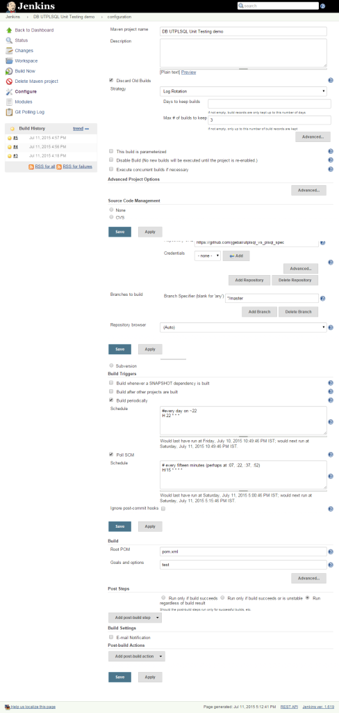](../../images/Jenkins-job-config-utplsql.png)
Here is the Jenkins job config.xml for the above job.
[xml collapse="1"]
<?xml version='1.0' encoding='UTF-8'?>
<maven2-moduleset plugin="maven-plugin@2.7.1">
<actions/>
<description></description>
<logRotator class="hudson.tasks.LogRotator">
<daysToKeep>-1</daysToKeep>
<numToKeep>3</numToKeep>
<artifactDaysToKeep>-1</artifactDaysToKeep>
<artifactNumToKeep>-1</artifactNumToKeep>
</logRotator>
<keepDependencies>false</keepDependencies>
<properties/>
<scm class="hudson.plugins.git.GitSCM" plugin="git@2.3.5">
<configVersion>2</configVersion>
<userRemoteConfigs>
<hudson.plugins.git.UserRemoteConfig>
<url>https://github.com/jgebal/utplsql\_vs\_plsql\_spec</url>
</hudson.plugins.git.UserRemoteConfig>
</userRemoteConfigs>
<branches>
<hudson.plugins.git.BranchSpec>
<name>\*/master</name>
</hudson.plugins.git.BranchSpec>
</branches>
<doGenerateSubmoduleConfigurations>false</doGenerateSubmoduleConfigurations>
<submoduleCfg class="list"/>
<extensions/>
</scm>
<canRoam>true</canRoam>
<disabled>false</disabled>
<blockBuildWhenDownstreamBuilding>false</blockBuildWhenDownstreamBuilding>
<blockBuildWhenUpstreamBuilding>false</blockBuildWhenUpstreamBuilding>
<triggers>
<hudson.triggers.TimerTrigger>
<spec>#every day on ~22
H 22 \* \* \*</spec>
</hudson.triggers.TimerTrigger>
<hudson.triggers.SCMTrigger>
<spec># every fifteen minutes (perhaps at :07, :22, :37, :52)
H/15 \* \* \* \*</spec>
<ignorePostCommitHooks>false</ignorePostCommitHooks>
</hudson.triggers.SCMTrigger>
</triggers>
<concurrentBuild>false</concurrentBuild>
<rootModule>
<groupId>com.tsl.plsqltest</groupId>
<artifactId>plsqltest</artifactId>
</rootModule>
<goals>test</goals>
<aggregatorStyleBuild>true</aggregatorStyleBuild>
<incrementalBuild>false</incrementalBuild>
<ignoreUpstremChanges>true</ignoreUpstremChanges>
<archivingDisabled>false</archivingDisabled>
<siteArchivingDisabled>false</siteArchivingDisabled>
<fingerprintingDisabled>false</fingerprintingDisabled>
<resolveDependencies>false</resolveDependencies>
<processPlugins>false</processPlugins>
<mavenValidationLevel>-1</mavenValidationLevel>
<runHeadless>false</runHeadless>
<disableTriggerDownstreamProjects>false</disableTriggerDownstreamProjects>
<blockTriggerWhenBuilding>true</blockTriggerWhenBuilding>
<settings class="jenkins.mvn.DefaultSettingsProvider"/>
<globalSettings class="jenkins.mvn.DefaultGlobalSettingsProvider"/>
<reporters/>
<publishers/>
<buildWrappers/>
<prebuilders/>
<postbuilders/>
<runPostStepsIfResult>
<name>FAILURE</name>
<ordinal>2</ordinal>
<color>RED</color>
<completeBuild>true</completeBuild>
</runPostStepsIfResult>
</maven2-moduleset>
[/xml]
Add all the utPLSQL tests to a test suite, so they can all be executed in one job.
The following code on was used on my database for user `tdd_test1`.

```sql
BEGIN
  utsuite.add('all');
  utpackage.add('all','sum_two_numbers');
  utpackage.add('all','sum_two_numbers_fail');
  utpackage.add('all','current_date');
  utpackage.add('all','current_date_fail');
  utpackage.add('all','message_api');
END;
/
```

After having all of the above steps executed, the job can be executed, and we can see the test results.

- history of builds (job executions), test results trend graph
[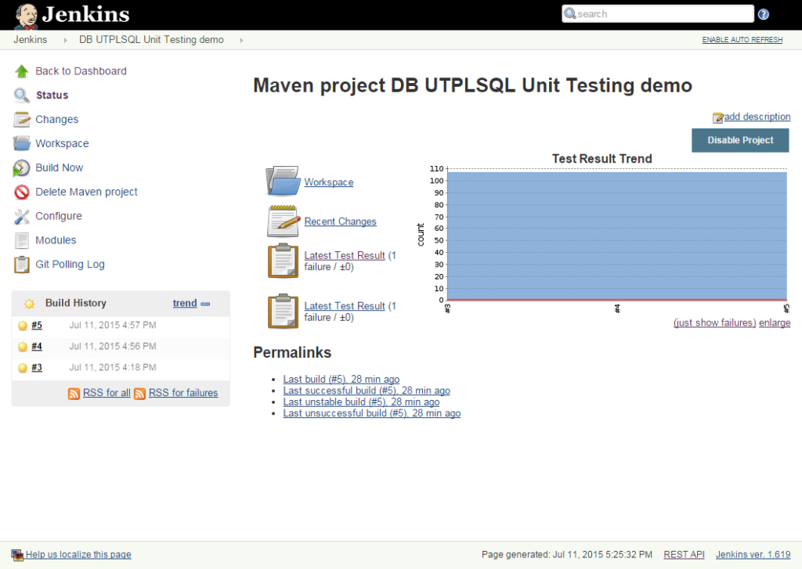](../../images/Jenkins-job-main-pageutplsql.png)
- timeline of builds with job durations
[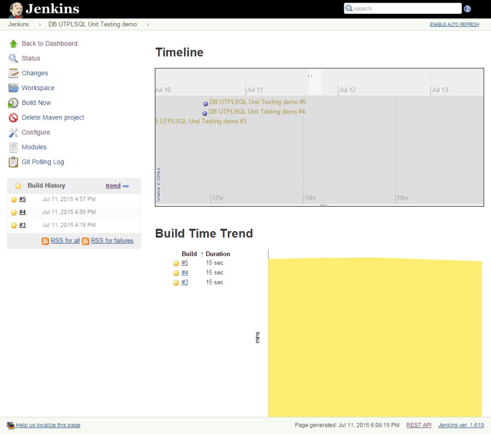](../../images/Jenkins-job-timelineutplsql.png)
- test results reports for every build
[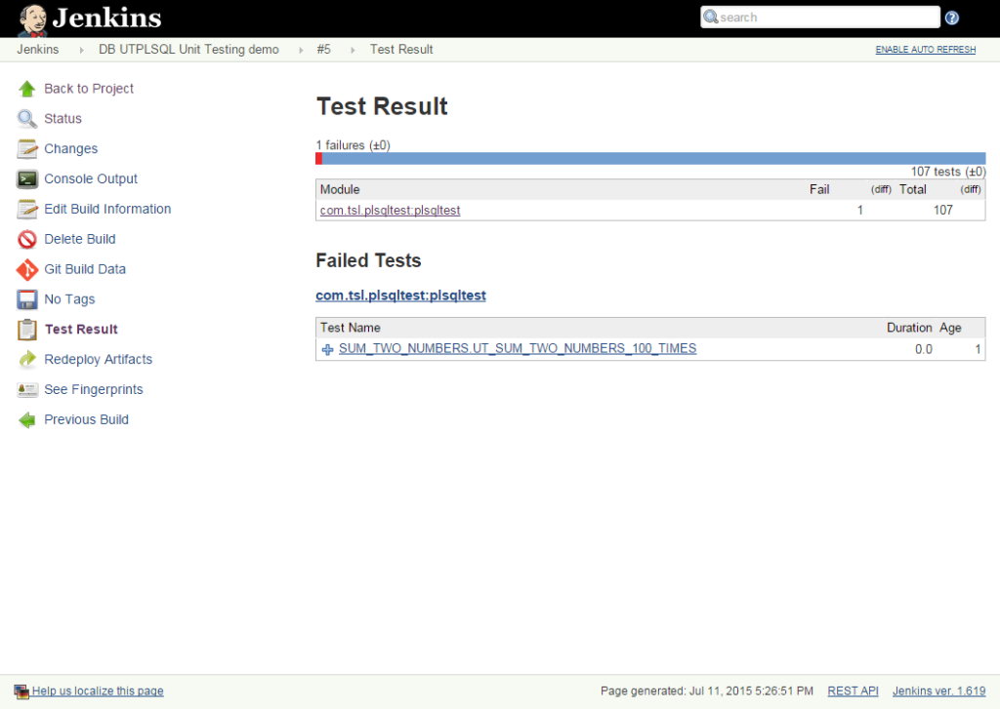](../../images/Jenkins-test-resultsutplsql.png)
- ability to navigate to detailed test results
[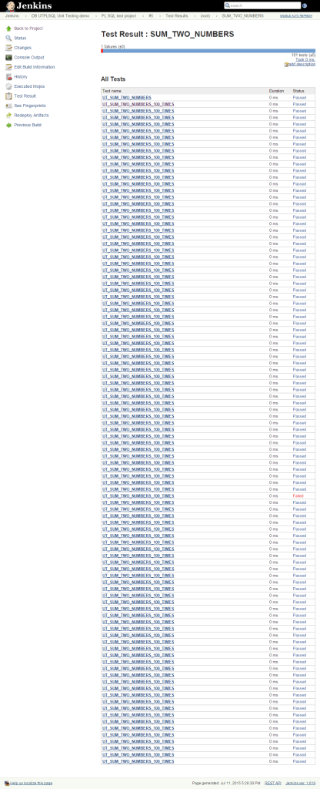](../../images/Jenkins-test-results-detailedutplsql.png)
- details of failed tests
[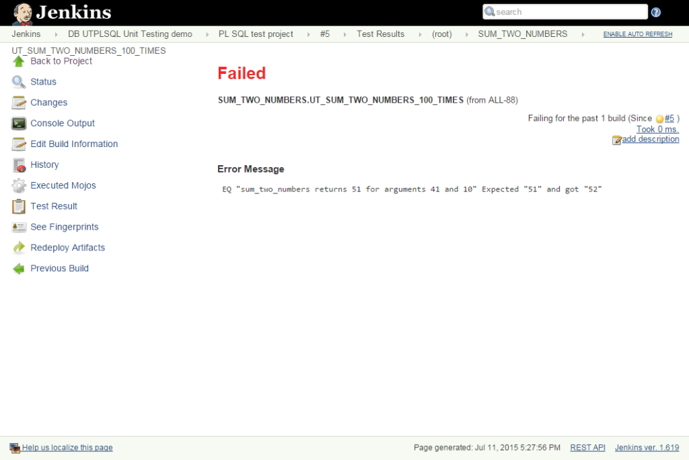](../../images/Jenkins-failed-testsutplsql.png)

- and more

# Summary

I've initially was very sceptic about running utPLSQL on Jenkins. that was mainly because of the need to use Maven with Java as a bridge between Jenkins and Oracle. Eventually I've decided to give it a try and it took about two hours to read through all the requirements, install the required software and configure it properly. It was not as bad as I initially thought.
Even though, both ruby-plsql and utPLSQL can be executed on Jenkins there are quite few differences to be pointed out:

- ruby-plsql comes with code coverage reporting out of the box
- utPLSQL does not support code coverage
- ruby-plsql (RSpec) unit tests have timing on each test execution and entire test run
- utPLSQL does not indicate time taken to execute test
- amazingly, ruby-plsql unit tests are executing much faster(4-6 seconds) than utPLSQL with Maven (15 seconds) - probably necause of time needed for Maven to start
- ruby-plsql test reports include full name and description of the test - in a human readable documentation form
- utPLSQL test reports include names of Unit Test packages and Unit Test procedures called - non descriptive, not suitable for documentation purposes
- with utPLSQL each assertion is shown as a separate test result, while the name of the test is the name of test procedure, not the assertion description, so you don't really know what was tested
- ruby-plsql indicates test file name, type of assertion, results and line of code the test failed
- utPLSQL does not include line number, which makes it harder to trace the error when tests are getting big
- ruby-plsql does not require any extra setup for Jenkins except the reporting library installation and making sure that the environment variables are setup properly for the job
- utPLSQL cannot be integrated on it own with Jenkins, requires basic knowledge of Maven, installation of Maven (and Java), additional Maven library for utPLSQL, installing JDBC dependencies for Maven, configuring Maven XML file
- utPLSQL unit tests need to be added to a test suite by executing a PLSQL configuration code. Whenever new tests are added, they need to be added to test suite too, that is an additional maintenance work to be done
